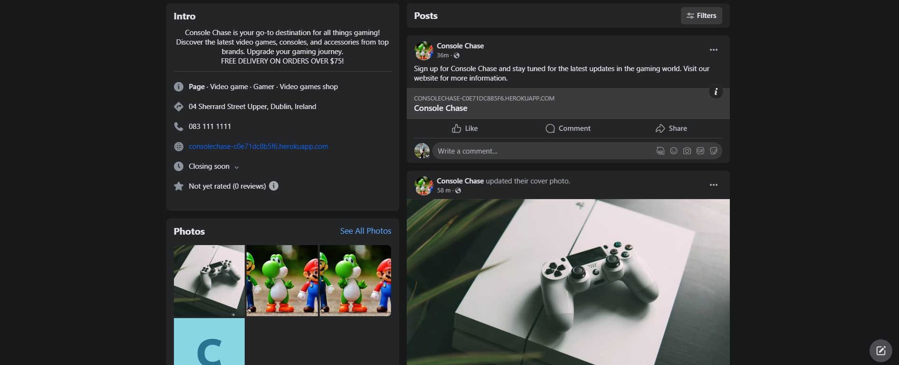

<div align ="center">

# **Console Chase**

</div>

[View the live site here](https://consolechase-c0e71dc8b5f6.herokuapp.com/)

<div align ="center">


</div>

## **Introduction**

Welcome to Console Chase! We're thrilled to be your premier destination for everything gaming-related. Our platform, developed as a culmination of a Web Development Application Diploma project, showcases cutting-edge technologies including HTML, CSS, Bootstrap, JavaScript, jQuery, Python, Django, Heroku PostgreSQL, and Stripe. Dive into our world of gaming excitement and explore a vast array of titles and experiences. For further details on cards numbers click [here](https://stripe.com/docs/testing#cards).


## **Contents**

- [User Experience (UX)](#user-experience-ux)
   - [User Stories](#user-stories)

- [Business Model Description](#business-model-description)
   - [Marketing Strategies](#marketing-strategies)
    - [Facebook](#facebook-page)

- [Design](#design)
  - [Colour Scheme](#colour-scheme)
  - [Typography](#typography)
  - [Imagery](#imagery)
  - [Features](#features)
  - [Future Features](#future-features)

- [Database Schema](#database-schema)

- [Information Architecture](#information-architecture)

- [Technologies \& Languages Used](#technologies--languages-used)
  - [Libraries \& Frameworks](#libraries--frameworks)
  - [Tools \& Programs](#tools--programs)
- [Testing](#testing)
- [Deployment](#deployment)
  - [Connecting to GitHub](#connecting-to-github)
  - [Django Project SetUp](#django-project-setup)
    - [Elephant SQL](#elephant-sql)
  - [Heroku Deployment](#heroku-deployment)
  - [Google Mail Setup](#google-mail-setup)
  - [AWS Config](#aws-config)
    - [Media Folder Setup](#media-folder-setup)
    - [Django AWS Connect](#django-aws-connect)
  - [Stripe Config](#stripe-config)
  - [Clone Project](#clone-project)
  - [Fork Project](#fork-project)

* [Credits](#credits)
* [Code](#code)
* [Acknowledgements](#acknowledgements)

---
## **User Experience (UX)**

## User Stories

### Regular Site User Stories
* As a public user, I can *enter login details** to **access the user account securely**.
* As a public user, I can **click on visible links in the footer** to **access relevant information and destinations**.
* As a public user, I can **select a navbar item for a specific category** to **narrow down the display of related products**.
* As a public user, I can **interact with sorting and view features on the 'All Products' page** to **enhance the shopping experience**.
* As a public user, I can view error pages with 'Home' links for seamless navigation back to the main page in case of missing or forbidden pages.
* As a public user, I can **register an email and receive a validation link via email to create an account** for **tracking spending and purchases**.


### Customer Shopper Stories
* As a shopper, I can **view the site's home page** to **understand its intentions and purpose**.
* As a shopper, I can **utilize the navigation bar** to **seamlessly explore and navigate the site**.
* As a shopper, I can **enter search queries into the search bar** to **locate specific items efficiently**.
* As a shopper, I can **navigate to the 'All Products' view** to **explore the complete product catalog**.
* As a shopper,  I can **create and manage** an account for storing personal details, order history, and expediting the checkout process.
* As a shopper, I can **edit personal details on the account** to **ensure they remain current and accurate**.
* As a shopper, I can select an individual product to access detailed information such as description, price, available colors, and sizes.
* As a shopper, I can **click on 'Add to Bag' in the product view** to **include the chosen item in the shopping bag**.
* As a shopper, I can **adjust quantities or remove products from the shopping bag** for **better control over the purchase**.
* As a shopper, I can **view the shopping bag total from any page** to **monitor potential spending**.
* As a shopper, I can **securely complete the checkout process** to **finalize the purchase**.
* As a shopper, I can **receive a confirmation email post-purchase** to **verify and maintain a record of the order**.
* As a shopper, I can **utilize the Contact Us form** to **communicate with the business/site admin**.
* As a shopper, I can **receive visual feedback during store interactions** to **confirm actions and choices**.
* As a shopper, I can **utilize the Contact Us form** to **communicate with the business/site admin**.
* As a shopper, I can **participate in reading and writing product reviews** to **make informed purchase decisions and share experiences with other users**.
* As a shopper, I can **provide my information through the newsletter form** to **receive emails regarding products**
* As a shopper, I can **utilize the Contact Us form** to **communicate with the business/site admin**.

 
### Customers Stories  (Logged in Users) 
* As a logged-in user, I can **click the 'Add to Wishlist' button** to **bookmark favorite items**.
* As a logged-in user, I can **click the 'Remove' icon beside Wishlist items** to **eliminate products from the Wishlist**.

### Site Admin  
* As a Site Admin, I can **add products to the inventory using a frontend form** to **expand the range/quantity of available products on the site**.
* As a Site Admin, I can **edit existing inventory details through a frontend form** to **modify stock quantities, sizes, colors, or product information**.
* As a Site Admin, I can **delete products from the inventory using a frontend form** to **remove them from sale**.

### Not Implemented User Stories

* **USER STORY**: Offer Discounts
- As a shopper, I can **apply a discount code, received via email**, to **redeem discounts on purchases**.
* **USER STORY**: Alert for Product Reviews
- As a public user, I can **receive notifications** when other users comment on reviews or find them helpful.

You can have access to the full Project page [here](https://github.com/users/ruimarnjr/projects/6/views/1).

### Business Model Description
Console Chase is an online retail platform specializing in the sale of video games and gaming accessories. Our business model revolves around providing a diverse range of gaming products to cater to the needs of gaming enthusiasts worldwide. Key elements of our business model include:

Product Range: We offer a wide selection of video games spanning various genres, platforms, and gaming consoles, including popular titles and exclusive releases.

Customer Experience: At Console Chase, we prioritize delivering an exceptional customer experience by providing user-friendly navigation, detailed product descriptions, and responsive customer support to assist users at every step of their shopping journey.

Competitive Pricing: We aim to remain competitive in the market by offering competitive pricing on our products while ensuring quality and value for our customers.

Shipping and Delivery: We provide efficient shipping and delivery options to ensure timely product arrivals, leveraging partnerships with reputable shipping carriers to offer reliable delivery services worldwide.

Payment Security: Console Chase prioritizes the security of online transactions by implementing robust payment security measures and partnering with trusted payment gateways to safeguard customers' financial information.

### Marketing Strategies

Facebook Page: Establishing a Facebook page for Console Chase to engage with our audience, share product updates, and interact with customers through comments, messages, and posts. The Facebook page will serve as a central hub for community engagement and brand communication.

Meta Tags Optimization: Implementing meta tags optimization on the website to improve visibility in search engine results and attract organic traffic. This includes optimizing meta titles, descriptions, and keywords related to gaming consoles and accessories.

Gamer-Focused Content: Creating content on the website tailored to the interests of gamers, including product reviews, gaming console comparisons, and tips for optimizing gaming experiences. This content will appeal to our target audience and position Console Chase as a valuable resource for gaming enthusiasts.

Social Media Engagement: Utilizing social media platforms such as Facebook, Instagram, and Twitter to engage with the gaming community, share product highlights, and showcase user-generated content. This approach will help build brand awareness and foster a sense of community among gamers.

Email Newsletter: Implementing an email newsletter subscription feature on the website to capture leads and communicate with customers. The newsletter will provide updates on new product releases, exclusive deals, and gaming-related content, encouraging repeat purchases and customer retention.

### Facebook Page




## **Design**

### Colour Scheme


* #344E41: This deep green shade evokes a sense of tranquility and nature, reminiscent of lush forests and serene landscapes.

* #3A5A40: A rich and earthy green, this color brings to mind the vitality of the great outdoors, symbolizing growth, freshness, and renewal.

* #588157: This muted teal hue strikes a balance between calmness and sophistication, representing harmony, stability, and a connection to nature.

* #A3B18A: A soft and subtle sage green, this color conveys a sense of tranquility and balance, offering a soothing and refreshing presence.

* #DAD7CD: A warm and inviting cream shade, this color exudes elegance and simplicity, creating a cozy and welcoming atmosphere.


### Typography

* The website employs the DM Sans font from [Google Fonts](https://fonts.google.com/) selected for its clarity and accessibility. DM Sans ensures that all content, buttons, and headings are easily readable and inviting, catering to customers with varying levels of visual acuity. This choice emphasizes the importance of clear communication, recognizing that if visitors struggle to read the menu, they're less likely to become regular customers.

### Imagery

* The captivating main image on the Home page, which sets the visual tone for the site, is sourced from Unsplash, providing an engaging backdrop that draws users' attention to the showcased products.
* The product images featured on the site are sourced from the Currys PC website, ensuring that customers can see accurate representations of the products available for purchase. This helps in providing users with a clear understanding of the items they are interested in.

## Features

* Home
  * Hero Image
  * List of Categories that lead to the Categorized Products when clicked


* Navigation Bar


* Search Bar


* Sort by product name:    


* Shop by Category:
   

* Newsletter + Contact Us:
     
     

* Contact Us Form can be seen in the Admin Panel
    
    

* Footer
   

* View a List of Products
    

* View product Details
   
  
* Add Products to Shopping Bag
 

 * Shopping Bag
 

* Update quantity and delete Products from Shopping Bag
   

* Complete purchases directly from the Shopping Bag.
* In case of payment failure, users are redirected back to the checkout form where they receive a notification indicating the unsuccessful transaction.
* Upon successful payment processing, users receive a confirmation message and are redirected to a comprehensive order details page.
* Registered users have the option to securely save their information for future purchases after completing a transaction.
  

   
* Stripe
 * Webhooks events are working perfectly fine once the payment is complete.
 
 

* Email Verification


* Profile
  * Update Profile
  * User's order history is saved on their profile.
  

* Register/Sign In
 
 
* Email Verification
   

* Sign Out
    

* Wishlist (for the logged in user)
  * Add or remove items from the Wishlist
  * Display wishlist items

   
   
  
  
  

* Diplay of Reviews with Username and the Date it was added, for each Product 
* Submit Reviews (for the logged in user)
* Edit Review
* Delete Review
  
  
  
  


* Store owner has the ability to add / edit and delete Products
   
   


* 404 Page Not Found
  


### Future Features

- Integrate a responsive chatbot feature, enabling seamless interaction and assistance for users navigating the site.
- Implement a robust account management system, empowering registered users to delete their accounts securely and efficiently.
- Develop a comprehensive Contact Page with various contact methods, facilitating effective communication between users and site administrators.
- Expand the site's offerings by providing site owners with the ability to effortlessly add new product categories and expand their product range.


### Database Schema

### Checkout

#### Order
**linked to OrderlineItem & Userprofile**
* order_number: CharField
* user_profile: ForeignKey to UserProfile
* full_name: CharField
* email: EmailField
* phone_number: CharField
* country: CountryField
* postcode: CharField
* town_or_city: CharField
* street_address1: CharField
* street_address2: CharField
* county: CharField
* date: DateTimeField
* delivery_cost: DecimalField
* order_total: DecimalField
* grand_total: DecimalField
* original_bag: TextField
* stripe_pid: CharField

#### OrderLineItem
**linked to Product & Order**
* order: ForeignKey to Order
* product: ForeignKey to Product
* quantity: IntegerField
* lineitem_total: DecimalField

### Home

#### ContactUs

* full_name: CharField 
* email: CharField 
* subject: CharField 
* message: TextField

### Products

#### Category
**linked to Products**
* name: CharField 
* friendly_name: CharField 

#### Product
**linked to Review & Category**
* category: ForeignKey to Category 
* sku: CharField 
* name: CharField 
* description: TextField
* price: DecimalField 
* image_url: URLField 
* image: ImageField 

#### Review
**linked to Product & UserProfile**
* product: ForeignKey to Product 
* rating: IntegerField 
* content: TextField
* created_by: ForeignKey to User 
* created_at: DateTimeField 

### Profiles

#### User Profile
**linked to Wishlist & Order**
* user: OneToOneField to User 
* default_phone_number: CharField 
* default_street_address1: CharField 
* default_street_address2: CharField 
* default_town_or_city: CharField 
* default_county: CharField 
* default_postcode: CharField 
* default_country: CountryField 

#### Wishlist
**linked to Product & UserProfile**
* profile_user: ForeignKey to UserProfile 
* product: ForeignKey to Product 

[Back to Top](#contents)

## **Information Architecture**

### Navigation bar

The navigation bar changes depending on user status and screen size:

| Nav Link | Logged Out | Logged In (User) | Logged In (Admin) |
|-------|-----|-----|-----|
| Logo (small screen) | &#10060; | &#10060; | &#10060; |
| Logo (large screen) | &#9989; | &#9989; | &#9989; |
| Home | &#9989; | &#9989; | &#9989; |
|Dropdown list of products categories | &#9989; | &#9989; | &#9989; |
| Contact Us | &#9989; | &#9989; | &#9989; |
| Search Bar | &#9989; | &#9989; | &#9989; |
| My Account | &#9989; | &#9989; | &#9989; |
| My Account dropdown - Login | &#9989; | &#10060; | &#10060; |
| My Account dropdown - Register | &#9989; | &#10060; | &#10060; |
| My Account dropdown - Profile | &#10060; | &#9989; | &#9989; |
| My Account dropdown - Log Out | &#10060; | &#9989; | &#9989; |
| My Account dropdown - Add Product | &#10060; | &#10060; | &#9989; |
| Wishlist | &#10060; | &#9989; | &#9989; |
| Shopping Bag Icon | &#9989; | &#9989; | &#9989; |

---

# Technologies & Languages Used

- HTML
- CSS
- JavaScript
- Python
- [Git](https://git-scm.com/) used for version control.
- [Github](https://www.github.com) used for online storage of codebase and Projects tool.
- [Gitpod](https://www.gitpod.io/) as an online, cloud-based IDE for development.
- [Django](https://www.djangoproject.com/) was used as the Python framework for the site.
- [Heroku](https://www.heroku.com) was used to host the 'consolechase' application.

## Libraries & Frameworks

Libraries and frameworks used were dictated by the 'Boutique Ado' walkthrough from our course material with the Code Institute. This project will be upgraded on completion of the course to more recent packages to meet current standards and security packages.

- [Django v3.2](https://docs.djangoproject.com/en/4.2/releases/3.2/) 
- [AllAuth v0.41](https://django-allauth.readthedocs.io/) for user authentication and account management.
- [Bootstrap v4.6](https://getbootstrap.com/docs/4.6/getting-started/introduction/) for template rendering.
- [Crispy Forms](https://pypi.org/project/crispy-bootstrap4/) for form rendering.
- [boto3](https://boto3.amazonaws.com/v1/documentation/api/latest/index.html) for AWS CRUD with Python scripts.
- [dj-database-url](https://pypi.org/project/dj-database-url/) for DATABASE_URL.
- [django-countries](https://pypi.org/project/django-countries/) for country field rendering in checkout form.
- [django-storages](https://django-storages.readthedocs.io/en/latest/) for handling static and media files.
- [gunicorn](https://docs.djangoproject.com/en/4.2/howto/deployment/wsgi/gunicorn/) apure-Python WSGI server for UNIX.
- [psycopg2](https://pypi.org/project/psycopg2/) s PostgreSQL database adapter for Python.
- [Stripe](https://stripe.com/en-ie) for processing console chase's payment system.

## Tools & Programs
- [Image ReSizer](https://www.simpleimageresizer.com/) for reducing image size
- [Favicon](https://favicon.io/) for converting an icon into a favicon.
- [amiresponsive](https://ui.dev/amiresponsive) for screenshot of Console Chase on different screen sizes.
- [Mailchimp](https://mailchimp.com/) is used for marketing with their newsletter subscription service.

# Testing

- For all testing, please refer to the [TESTING.md](TESTING.md) file.

# Deployment

## Connecting to GitHub  

To begin this project from scratch, you must first create a new GitHub repository using the [Code Institute's Template](https://github.com/Code-Institute-Org/ci-full-template). This template provides the relevant tools to get you started. To use this template:

1. Log in to [GitHub](https://github.com/) or create a new account.
2. Navigate to the above CI Full Template.
3. Click '**Use this template**' -> '**Create a new repository**'.
4. Choose a new repository name and click '**Create repository from template**'.
5. In your new repository space, click the purple CodeAnywhere (if this is your IDE of choice) button to generate a new workspace.

## Django Project SetUp

1. Install Django and supporting libraries:

- ```pip3 install 'django<4' gunicorn```
- ```pip3 install dj_database_url psycopg2``` 
  
1. Once you have installed any relevant dependencies or libraries, such as the ones listed above, it is important to create a **requirements.txt** file and add all installed libraries to it with the ```pip3 freeze --local > requirements.txt``` command in the terminal.  
2. Create a new Django project in the terminal ```django-admin startproject consolechase .```
3. Create a new app eg. ```python3 mangage.py startapp home```
5. Add this to list of **INSTALLED_APPS** in **settings.py** - 'home',
6. Create a superuser for the project to allow Admin access and enter credentials: ```python3 manage.py createsuperuser```
7. Migrate the changes with commands: ```python3 manage.py migrate```
8. An **env.py** file must be created to store all protected data such as the **DATABASE_URL** and **SECRET_KEY**. These may be called upon in your project's **settings.py** file along with your Database configurations. The **env.py** file must be added to your **gitignore** file so that your important, protected information is not pushed to public viewing on GitHub. For adding to **env.py**:

- ```import os```
- ```os.environ["DATABASE_URL"]="<copiedURLfromElephantSQL>"```
- ```os.environ["SECRET_KEY"]="my_super^secret@key"```
  
For adding to **settings.py**:

- ```import os```
- ```import dj_database_url```
- ```if os.path.exists("env.py"):```
- ```import env```
- ```SECRET_KEY = os.environ.get('SECRET_KEY')``` (actual key hidden within env.py)  

9. Replace **DATABASES** with:

```
DATABASES = {
    'default': dj_database_url.parse(os.environ.get("DATABASE_URL"))
  }
```

10. Set up the templates directory in **settings.py**:

- Under ``BASE_DIR`` enter ``TEMPLATES_DIR = os.path.join(BASE_DIR, ‘templates’)``
- Update ``TEMPLATES = 'DIRS': [TEMPLATES_DIR]`` with:

```
os.path.join(BASE_DIR, 'templates'),
os.path.join(BASE_DIR, 'templates', 'allauth')
```

- Create the media, static and templates directories in the top level of the project file in the IDE workspace.

11. A **Procfile** must be created within the project repo for Heroku deployment with the following placed within it: ```web: gunicorn consolechase.wsgi```
12. Make the necessary migrations again.

### Elephant SQL

A new database instance can be created on [Elephant SQL](https://www.elephantsql.com/) for your project. 

- Choose a name and select the **Tiny Turtle** plan, which is free.
- Select your Region and the nearest Data Center to you. 
- From your user dashboard, retrieve the important 'postgres://....' value. Place the value within your **DATABASE_URL**  in your **env.py** file and follow the below instructions to place it in your Heroku Config Vars.

## Heroku Deployment

To start the deployment process , please follow the below steps:

1. Log in to [Heroku](https://id.heroku.com/login) or create an account if you are a new user.
2. Once logged in, in the Heroku Dashboard, navigate to the '**New**' button in the top, right corner, and select '**Create New App**'.
3. Enter an app name and choose your region. Click '**Create App**'.
4. In the Deploy tab, click on the '**Settings**', reach the '**Config Vars**' section and click on '**Reveal Config Vars**'. Here you will enter KEY:VALUE pairs for the app to run successfully. The KEY:VALUE pairs that you will need are your:

   - **DATABASE_URL**:**postgres://...**
   - **DISABLE_COLLECTSTATIC** of value '1' (N.B Remove this Config Var before deployment),
   - **SECRET_KEY** and value  
   - **AWS_ACCESS_KEY** and value
   - **AWS_SECRET_ACCESS_KEY** and value
   - **EMAIL_HOST_PASS** and value
   - **EMAIL_HOST_USER** and value
   - **STRIPE_PUBLIC_KEY** and value
   - **STRIPE_SECRET_KEY** and value
   - **STRIPE_WH_SECRET** and value
   - **USE_AWS** and value

5. Add the Heroku host name into **ALLOWED_HOSTS** in your projects **settings.py file** -> ```['herokuappname', ‘localhost’, ‘8000 port url’].```
2. Once you are sure that you have set up the required files including your requirements.txt and Procfile, you have ensured that **DEBUG=False**, save your project, add the files, commit for initial deployment and push the data to GitHub.
3. Go to the '**Deploy**' tab and choose GitHub as the Deployment method.
4. Search for the repository name, select the branch that you would like to build from, and connect it via the '**Connect**' button.
5. Choose from '**Automatic**' or '**Manual**' deployment options, I chose the 'Manual' deployment method. Click '**Deploy Branch**'.
6.  Once the waiting period for the app to build has finished, click the '**View**' link to bring you to your newly deployed site. If you receive any errors, Heroku will display a reason in the app build log for you to investigate. **DISABLE_COLLECTSTATIC**  may be removed from the Config Vars once you have saved and pushed an image within your project.

## Google Mail Setup

1. Setup a Gmail Account that will be used to hold and store the emails for your project.
2. Logged in, navigate to **Settings** -> **Other Google Account Settings** -> **Accounts** -> **Import** -> **Other Account Settings**
3. Activate 2-Step Verification
4. Once verified access **App Passwords** -> **Other** -> enter a name for the password, eg ConsoleChase.
5. Click **Create** -> copy the 16 digit password that is generated.
6. In your `settings.py` add the following Email Settings:
     
   *Django Email Settings for ConsoleChase Email setup*  
7. Add EMAIL_HOST_PASS, EMAIL_HOST_USER variable, password and email address to your Heroku Config Vars
    
## AWS Config

[AWS](https://aws.amazon.com) is used to store the media and static files online for Console Chase. Please follow the below steps to set it up for yourself:

1. Setup AWS Account and Login
2. Create a new S3 Bucket -> name it to match your Heroku App name -> Choose the region closest to you.
3. Allow **Clock All Public Access**, tick 'Bucket will be public' in order for the bucket to connect to Heroku. 
4. In **Object Ownership** -> **ACLS Enabled** -> **Bucket Owner Preferred**.
5. **Properties** tab -> turn on static web hosting and add 'index.html' and 'error.html' into the correct fields -> click **Save**
6. In the **Permissions** tab, paste in the following CORS config:

   ```
	[
		{
			"AllowedHeaders": [
				"Authorization"
			],
			"AllowedMethods": [
				"GET"
			],
			"AllowedOrigins": [
				"*"
			],
			"ExposeHeaders": []
		}
	]
	```
7. Copy your **ARN** string.
8. From the **Bucket Policy** tab, select the **Policy Generator** link, and use the following steps:
	- Policy Type: **S3 Bucket Policy**
	- Effect: **Allow**
	- Principal: `*`
	- Actions: **GetObject**
	- Amazon Resource Name (ARN): **paste-your-ARN-here**
	- Click **Add Statement**
	- Click **Generate Policy**
	- Copy the entire Policy, and paste it into the **Bucket Policy Editor**

		```shell
		{
			"Id": "Policy1234567890",
			"Version": "2012-10-17",
			"Statement": [
				{
					"Sid": "Stmt1234567890",
					"Action": [
						"s3:GetObject"
					],
					"Effect": "Allow",
					"Resource": "arn:aws:s3:::bucket-name/*"
					"Principal": "*",
				}
			]
		}
		```
    - Before you click "Save", add `/*` to the end of the Resource key in the Bucket Policy Editor (like above).
	- Click **Save**.
9. In the **ACL - Access Control List** -> **Edit** -> enable **List** for **Everyone(Public Access)** -> Accept the warning.

### AWS - IAM setup

1. AWS Services Menu -> **Create New Group** -> add name eg. 'group-project-name'.
2. Navigate from there to **REview Policy** page -> **User Groups** -> Select newly named group.
3. Navigate to **Permissions** tab -> **Add Permissions** -> Click **Attach Policies**
4. Select policy -> **Add Permissions** at the bottom, click when finished.
5. From **JSON** tab -> select **Import Managed Policy** link -> search for **S3** -> select **Amazon3FullAccess** policy -> **Import**.
6. Copy **ARN** from S3 Bucket again ->

   ```
		{
			"Version": "2012-10-17",
			"Statement": [
				{
					"Effect": "Allow",
					"Action": "s3:*",
					"Resource": [
						"arn:aws:s3:::bucket-name",
						"arn:aws:s3:::bucket-name/*"
					]
				}
			]
		}
	```
7. Click **Review Policy** -> name eg. 'policy-consolechase' -> enter a description -> **Create Policy**
8. Search for your new policy and click it to **Attach Policy**
9. **User Groups** -> **Add User** -> name eg. 'user-consolechase'
10. For **Select AWS Access Type** -> select **Programmatic Access** -> Add group to 'user-consolechase' -> **Review User** -> **Create User**.
11. Find **Download.csv** button to download immediately and save a copy.
    - This contains the user's **Access key ID** and **Secret access key**.
	- `AWS_ACCESS_KEY_ID` = **Access key ID**
	- `AWS_SECRET_ACCESS_KEY` = **Secret access key** 

### Media Folder Setup
1. In Heroku Config Vars, remove `DISABLE_COLLECTSTATIC`.
2. In AWS S3 create a new folder -> **media** -> Add project images -> **Manage Public Permissions** -> **Grant public read access to the objects** -> **Upload**

### Django AWS Connect

1. Packages needed to use AWS S3 Buckets in Django:
   - `pip3 install boto3`
   - `pip3 install django-storages`
2. In settings.py add:
   ```
   INSTALLED_APPS = [
       'storages',
   ]
3. In env.py ensure AWS variables are present for `AWS_ACCESS_KEY_ID`, `AWS_SECRET_ACCESS_KEY` and environment variable paths are in settings.py:
   ```
   import os
   from pathlib import Path
   import dj_database_url

   if os.path.isfile('env.py'):
   import env
   ```
4. Ensure DATABASES are set up to connect with Heroku Postgres server in production vs SQLite3 when in local development.
   ```
   if "DATABASE_URL" in os.environ:
	DATABASES = {
		"default": dj_database_url.parse(os.environ.get("DATABASE_URL"))
	}
    else:
	DATABASES = {
		"default": {
			"ENGINE": "django.db.backends.sqlite3",
			"NAME": os.path.join(BASE_DIR, "db.sqlite3"),
		}
	}
    ```
5. Setup media and static file storage in settings.py:
   ```
   STATIC_URL = "/static/"
   STATICFILES_DIRS = (os.path.join(BASE_DIR, "static"),)

   MEDIA_URL = "/media/"
   MEDIA_ROOT = os.path.join(BASE_DIR, "media")
   ```
6. S3 Bucket config in settings.py is as follows:
   ```
   if 'USE_AWS' in os.environ:
    # Cache control
    AWS_S3_OBJECT_PARAMETERS = {
        'Expires': 'Thu, 31 Dec 2099 20:00:00 GMT',
        'CacheControl': 'max-age=94608000',
    }

    # Bucket Config
    AWS_STORAGE_BUCKET_NAME = 'consolechase'
    AWS_S3_REGION_NAME = 'eu-west-1'
    AWS_ACCESS_KEY_ID = os.environ.get('AWS_ACCESS_KEY_ID')
    AWS_SECRET_ACCESS_KEY = os.environ.get('AWS_SECRET_ACCESS_KEY')
    AWS_S3_CUSTOM_DOMAIN = f'{AWS_STORAGE_BUCKET_NAME}.s3.amazonaws.com'

    # Static and media files
    STATICFILES_STORAGE = 'custom_storages.StaticStorage'
    STATICFILES_LOCATION = 'static'
    DEFAULT_FILE_STORAGE = 'custom_storages.MediaStorage'
    MEDIAFILES_LOCATION = 'media'

    # Override static and media URLs in production
    STATIC_URL = f'https://{AWS_S3_CUSTOM_DOMAIN}/{STATICFILES_LOCATION}/'
    MEDIA_URL = f'https://{AWS_S3_CUSTOM_DOMAIN}/{MEDIAFILES_LOCATION}/'
    ```
7. In the main project directory create a 'custom_storages.py' file and add the following:
   ```
     from django.conf import settings
  from storages.backends.s3boto3 import S3Boto3Storage

class StaticStorage(S3Boto3Storage):
	location = settings.STATICFILES_LOCATION

class MediaStorage(S3Boto3Storage):
	location = settings.MEDIAFILES_LOCATION
    ```
8. AWS S3 Bucket is now connected through the above settings and Heroku's Config Vars.

## Stripe Config

Stripe's API is used to handle console chase's payment system. To setup follow the below steps:

1. Create and log in to a Stripe account.
2. In the Stripe Dashboard -> **Get your test API keys.**
3. Add your `STRIPE_PUBLIC_KEY` and `STRIPE_SECRET_KEY` to your env.py, connect to your settings.py using your environment variables and then enter them into your project's Heroku Config Vars.
4. Including Stripe's Webhooks creates a failsafe if a customer exits the page during payment authorisation. In Stripe's Dashboard -> **Developers** -> **Webhooks** -> **Add Endpoint**: 'herokuapp url/checkout/wh'
5.  Choose **Retrieve all events** -> **Add Endpoint**.
6.  Add new key **STRIPE_WH_SECRET** to env.py, settings.py and Heroku Config Vars as before.

## Clone Project

A local clone of this repository can be made on GitHub. Please follow the below steps:

1. Navigate to GitHub and log in.
2. The [Console Chase Repository](https://github.com/ruimarnjr/ConsoleChase) can be found at this location.
3. Above the repository file section, locate the '**Code**' button.
4. Click on this button and choose your clone method from HTTPS, SSH or GitHub CLI, copy the URL to your clipboard by clicking the '**Copy**' button.
5. Open your Git Bash Terminal.
6. Change the current working directory to the location you want the cloned directory to be made.
7. Type `git clone` and paste in the copied URL from step 4.
8. Press '**Enter**' for the local clone to be created.
9. Using the ``pip3 install -r requirements.txt`` command, the dependencies and libraries needed for FreeFido will be installed.
10. Set up your **env.py** file and from the above steps for ElephantSQL, gather the Elephant SQL url for addition to your code and add your SECRET_KEY and STRIPE/AWS keys if using these services.
11. Ensure that your **env.py** file is placed in your **.gitignore** file and follow the remaining steps in the above Django Project Setup section before pushing your code to GitHub.

## Fork Project

A copy of the original repository can be made through GitHub. Please follow the below steps to fork this repository:  

1. Navigate to GitHub and log in.  
2. Once logged in, navigate to this repository using this link [ConsoleChase Repository](https://github.com/ruimarnjr/ConsoleChase).
3. Above the repository file section and to the top, right of the page is the '**Fork**' button, click on this to make a fork of this repository.
4. You should now have access to a forked copy of this repository in your Github account.
5. Follow the above Django Project Steps if you wish to work on the project.


[Back to Top](#contents)

---

## **Testing And Project Barrier Solutions**

All testing and project barriers and solutions has been documented here - [TESTING.md](https://github.com/KonstantinaStrantzali/FreshNow-food-corner/blob/master/TESTING.md)

[Back to Top](#contents)

---


## **Credits**

### Code

* A large amount of code came from the Code Institute, Boutique Ado Mini Project Walkthrough by Chris Zielinski.
* The core functionality of Console Chase all  taken from the Boutique Ado project. 
* Some features of the Reviews Model from [Code with Stein](https://www.youtube.com/watch?v=8iCqlFyFu2s) 
* Django Documentation. 
* Stackoverflow for looking up any question about django error codes and bug fixes.

### Acknowledgements

* Thanks to everyone from Code Institute who have helped me on this journey. I'm grateful for every bug and headache because it has led me to where I am today. This is just the beginning of my coding journey.
* A very special thanks to my girlfriend Camila Almeida, who supported me during the toughest moments and pushed me until the end. I'm really lucky to have her by my side.

