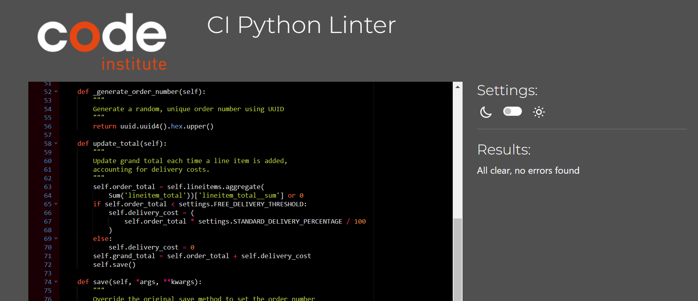
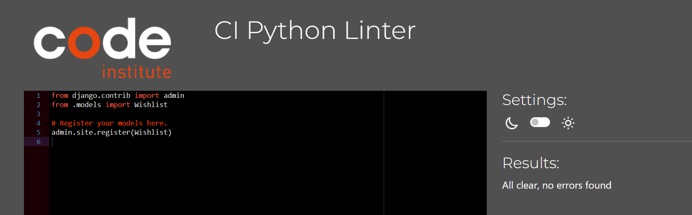

# Testing

This is the TESTING file for the [Console Chase]() website.

Return back to the [README.md](README.md) file.

## Testing Contents  
  
- [Testing](#testing)
  - [Testing Contents](#testing-contents)
  - [Validation](#validation)
    - [HTML Validation](#html-validation)
    - [JavaScript Validation](#javascript-validation)
    - [Python Validation](#python-validation)
    - [CSS Validation](#css-validation)
    - [Lighthouse Scores](#lighthouse-scores)
    - [Wave Accessibility Score](#wave-accessibility-score)
  - [Manual Testing](#manual-testing)
    - [User Input/Form Validation](#user-inputform-validation)
    - [Browser Compatibility](#browser-compatibility)
    - [Responsiveness](#responsiveness)
    - [Testing User Stories](#testing-user-stories)
    - [Dev Tools/Real World Device Testing](#dev-toolsreal-world-device-testing)
  - [Bugs](#bugs)
    - [Unresolved/Known Bugs](#unresolvedknown-bugs)

## Validation

### HTML Validation

For my HTML files I have used [HTML W3C Validator](https://validator.w3.org) to validate all of my HTML files.

  

All HTML pages were validated and received a 'No errors or warning to show' for code that I had written, result as shown above.

| HTML Source Code/Page | Errors | Warnings |
| ---- | ------ | -------- |
| Home | 0 | 0 |
| Wishlist | 0 | 0 |
| Product Detail | 0 | 0 |
| Admin Add Product | ID error -> To tackle the issue stemming from Bootstrap's form elements, unrelated to my code, the clash between the contact form's and the add product form's ID elements in the base.html file needs attention. Regrettably, these embedded ID elements remain out of reach for adjustments without significant modifications and restructuring of my code.   | |
| Admin Edit Product | ID error -> To tackle the issue stemming from Bootstrap's form elements, unrelated to my code, the clash between the contact form's and the add product form's ID elements in the base.html file needs attention. Regrettably, these embedded ID elements remain out of reach for adjustments without significant modifications and restructuring of my code.   | | | 0 |
| Products | 0 | 0 |
| Bag  | 0 | 0 |
| Edit Review - | 0 | 0 |
| Checkout | 0 | 0 |
| Checkout Success | 0 | 0 |
| Profile | 0 | 0 |
| Error 404 | 0 | 0 |

### JavaScript Validation

[JSHint](https://jshint.com/) was used to validate the JavaScript code added to the project. External JS, for Bootstrap, jQuery and Fontawesome purposes were not validated through JSHint.

| Page | Screenshot | Errors | Warnings |
| ---- | ---------- | ------ | -------- |
| Bag |  | none | none |
| Country Field |  | none | none |
| Increment Quantity |  | none | none |
| Stripe JS |  | none | none |
| Sort |  | none | none |

### Python Validation

[CI Python Linter](https://pep8ci.herokuapp.com/#) was used to validate the Python files that were created or edited by myself. No issues presented and line lengths were double checked. I have included some screenshots with the results below. none = no issues present.

| Feature | admin | forms | models | urls | views | extra |
|---------|----------|----------|-----------|---------|----------|-------|
| Bag  | n/a | n/a | n/a |  |  1 warning: line too long. It's the first line that is rendering stuff. Decided to keep it like this for indentation purposes | | |
| Checkout |  |  |  |  |  4 line too big warnings. Unable to fix due to indentation purposes.|| n/a |
| Home |  | none |  |  |  | n/a |
| Products |  |  |  |  | 1 warning "block comment should start with #(block comment is starting with #) 3 line too big warnings. Unable to fix due to indentation purposes. | none |
| Profiles |  |  |  |  |  | n/a |
| Wishlist |  | none |  |  |  | none |

### CSS Validation

[W3C CSS Validator](https://jigsaw.w3.org/css-validator/) was used to validate my CSS files. External CSS for Bootstrap, provided by [CDN](https://cdn.jsdelivr.net/npm/bootstrap@4.6.2/dist/css/bootstrap.min.css) was not tested.

To keep my document concise I have not included every screenshot of the CSS validations, as they are all the same, but the results are as follows.

| CSS File | Errors | Warnings |
| ---- | ------ | -------- |
| Profiles | 0 | 0 |
| Base CSS | 0 | 0 |

### Lighthouse Scores

Lighthouse testing was carried out in Incognito mode to achieve the best result. Images used in the site's design were saved in png format, and compressed using [tinypng](https://tinypng.com/) and [Convertio](https://www.convertio.co) to offer the best chance for a decent performance score.

| Page | Lighthouse Scores - Desktop | Notes |
| ---- | ----------------- | -------- |
| Home |      |      Score lower due to aspect ratio or images, not using webp images and Stripe Cookie    |
| All  |    |  None        |
| Read  |    |   None  |
| Account |                |    As before with Stripe Cookie  |
| Wishlist |     |  As before with images rendering and Stripe Cookie   |

| Page | Lighthouse Scores - Mobile | Notes |
| ---- | ----------------- | -------- |
| Home |   |  Score lower due to images not being webp and STripe/jQuery CDN. I will look into this for future versions to better understand how I can improve this score.  |
| All  |    | As before  |
| Read |   |  As before  |
| Account |    |  As before  |
| Wishlist |   | As before   |

## Manual Testing

### User Input/Form Validation

Testing was carried out on desktop using a Chrome browser to ensure all forms take the intended input and process the input appropriately.

| Feature                    | Tested?  | User Input Required | User Feedback Provided     | Pass/Fail | Fix |
|----------------------------|----------|---------------------|----------------------------|-----------|-----|
| Navbar Logo and Icons      | Yes      | Click Links bring user to correct destination    | Text Colour Change/Icon Animation/Dropdowns | Pass | N/A |
| Home Page                  | Yes      | Hover/Click interactive features | Carousel moves, Accordion FAQ section | Pass | N/A |
| Register Page              | Yes      | Text Input/Click Links | Form field highlight/Font weight change on hover/Toast message | Pass | N/A |
| Email Validate             | Yes      | Click Links | Button animation/Toast message | Pass | N/A |
| Forgot Password             | Yes     | Text Input/Click Links | Form field highlight/Button animation/Toast message | Pass | N/A |
| Log In Page                | Yes      | Text Input/Click Links | Form field highlight/Font weight on hover/Toast message | Pass | N/A |
| Log Out Page               | Yes      | Click Links bring user to correct destination | Button animation/Font color change/Toast message | Pass | N/A |
| Account - Edit Address     | Yes      | Text Input/Click to Save | Form field highlight/Button animation/Toast message | Pass | N/A |
| Search                     | Yes      | Text Input/Click to Search | Pop up Modal/Form field highlight/Button Animation | Pass | N/A |
| Contact Us Form            | Yes      | Text Input/Click to Save | Pop up Modal/Form field highlight/Button animation | Pass | N/A |
| Newsletter Sign Up         | Yes      | Text Input/ Click to Subscribe | Button animation/New tab subscription confirmation | Pass | N/A |
| Admin Dashboard            | Yes      | Click Links brings user to correct URL | Button animation on hover | Pass | N/A |
| Products                   | Yes      | Click product brings user to product description | Pointer change on hover of products | Pass | N/A |
| Add Product                | Yes      | Navigated to Admin Dashboard, clicked 'Add Product', Completed form, Form submits correctly to display the product. | Form field highlight/Button animation/Toast message, new product uploaded. | Pass | N/A |
| Edit Product               | Yes      | Navigated to Admin Dashboard, clicked 'Edit Product', Completed form, Form submits correctly to display the edited product. | Form field highlight/Button animation/Toast message, product updated. | Pass | N/a |
| View Article               | Yes      | Click link for article | Article card border change on hover | Pass | N/A |
| Add Article                | Yes      | Navigated to Admin Dashboard, clicked 'Add Article', Completed form, Form submits correctly to display the article. | Form field highlight/Button animation/Toast message, new article uploaded. | Pass | N/A |
| Edit Article               | Yes      | Navigated to Admin Dashboard, clicked 'Edit Article', Completed form, Form submits correctly to display the edited article. | Form field highlight/Button animation/Toast message, article edited and uploaded. | Pass | N/A |
| Product Quantity           | Yes      | Click increment/decrement | Colour change on hover/product quantity successfully changed | Pass | N/A |
| Product Sizes              | Yes      | Click dropdown/Click to select | Form field highlight/Size highlight | Pass | N/A |
| Checkout                   | Yes      | Click 'Secure Checkout', correct products in bag, entered delivery and payment details, submitted form to process payment. | Form field highlight/Button animation/Toast message, Loading spinner when processing order, order processed saved to account and email sent. | Pass | N/A |
| Footer                     | Yes      | Click Link brings user to FAQ section on Home Page | Font colour change on hover | Pass | N/A |
| Delivery Banner            | Yes      | Click dropdown to reveal banner | Dropdown arrow resize on hover/banner dropdown | Pass | N/A |

### Browser Compatibility

Console Chase was tested on the following browsers, purchases were made, article/products added/edited/deleted, error pages, all features were accessible and working as intended:

- Chrome v117.0.5938.92
- Firefox v114.0.2
- Edge v114.0.1823.79
- Safari v16.5.1

| Browser | Issue | Functionality |
|---------|-------|---------------|
| Firefox | None  | All Intact    |
| Edge    | None  | All Intact    |
| Safari (iPad Pro) | None | All Intact  |
| Chrome (Main browser used in development) | None | All Intact |

### Responsiveness

Using the Bootstrap framework allowed a more rapid development of a responsive website. Starting with mobile first, Console Chasewas created to ensure the customer has an unhindered, positive experience when shopping. Console Chase was regularly tested during development using Dev Tools to check for display issues on iPhone4 -> iPhone 12/Samsung Galaxy S20, iPad/iPad Pro and laptop/desktop screen sizes. Once deployed to Heroku, Console Chase was tested on real world devices. No major issues were detected, changes were made to the checkout view to remove the product image on smaller screens and only display important product information. There were no major differences between desktop and tablet views thanks to the Bootstrap Grid system of columns. A selection of the screen size view differences are displayed below:

  
*Console Chase Desktop/Mobile Home Responsive Views*

  
*Console Chase Desktop/Mobile Products Responsive Views*

  
*Console Chase Desktop/Mobile Articles Responsive Views*

  
*Console Chase Desktop/Mobile Bag Responsive Views*

### Testing User Stories

User Stories are documented in the Console Chase [GitHub Projects Board](https://github.com/users/ruimarnjr/projects/6/views/1). User Stories are completed, with Acceptance Criteria and Tasks detailed within. Testing was carried out on Dev Tools for desktop/tablet/mobile, by creating multiple accounts for test users: Test01, Test02, Test03 etc and following through by ensuring that the Acceptance Criteria were met. All features were tested to ensure that they provided the user with the expected output and action.

| User Story                 | Acceptance Criteria Met?  | Tested | Response     | Pass/Fail | Fix     |
|----------------------------|---------------------------|--------|--------------|-----------|---------|
| As a **customer**, I can **view the site's home page** so that I can **understand the site's intentions and purpose**. | Yes | Yes | Home page is visible | Pass | n/a |
| As a **customer**, I can **see and use the navigation bar** so that I can **make my way around the site and get to where I would like**. | Yes | Yes | Navbar visible to all users in desktop/tablet and mobile views | Pass | n/a |
| As a **customer**, I can **enter text into the search bar** so that I can **search for a specific item**. | Yes | Yes | Search bar accepts user input and returns search results when search form is submitted | Pass | n/a |
| As a **customer** I can **create and manage an account with Console Chase** so that I can **keep my personal details, order history and speed up my checkout process**. | Yes | Yes | Register form takes new user information, sends verification email link to confirm account. User may then sign in to view their account, edit their personal information and start saving their order histories from purchases made | Pass | n/a |
| As a **customer**, I can **edit my personal details on my account** so that I can **keep them up to date**. | Yes | Yes | User information is editable | Pass | n/a |
| As a **site user**, I can **enter my login details** so that I can **login in to my account**. | Yes | Yes | User may login with correct details | Pass | n/a |
|  As a **site user**, I can **click on the visible links in the footer** so that I can **view the relevant information and destinations**. | Yes | Yes | Footer links return user to relevant area in website and external links open in a new tab | Pass | n/a |
| As a **site user**, I can **register my email and receive a validation link via email** so that I can **create an account with Console Chase to track my spending and purchases**. | Yes | Yes | Registration process works as expected to accept new users | Pass | n/a |
| As a **customer**, I can **use the Contact Us form** so I can **send a message to the business/site admin**. | Yes | Yes | Contact form opens in a modal, accepts user input, submits form and returns thank you page for user, and email to Console Chase Admin's inbox. | Pass | n/a |
| As a **site user** I can **interact with sorting and view features on the 'All Products' page** so that I can **improve my shopping experience on the site**. | Yes | Yes | Price, category, A-Z, rating works as expected to display products in a certain order. | Pass | n/a |
| As a **site user**, I can **click on a navbar item for a specific category** so that I can **choose to view a smaller amount of related products**. | Yes | Yes | Products sorted correctly into categories. | Pass | n/a |
| As a **customer**, I can **choose an individual product** so that I can **view its description, price, colours, sizes available etc**. | Yes | Yes | Individual products returned when clicked on, all relevant information displayed and is interactable. | Pass | n/a |
| As a **site admin** I can **add a product to my inventory using a frontend from** so that I can **increase my range/amount of products available on site**. | Yes | Yes | Add product form takes new information and displays it in the product template correctly. | Pass | n/a |
| As a **site admin**, I can **edit existing inventory from a frontend form** so I can **change the quantity of stock, sizes, colours or edit products description, price or image**. | Yes | Yes | Edit product form takes user input and returns it correctly in the template. Product stock levels will be implemented in future features. | Pass | n/a |
| As a **site admin**, I can **delete products from the inventory using a frontend form** so that I can **remove it from sale**. | Yes | Yes | Delete product modal appears when clicked on and delete confirmation is needed before product is removed from database. | Pass | n/a |
| As a **customer** I can **create and manage an account with Console Chase** so that I can **keep my personal details, order history and speed up my checkout process**. | Yes | Yes | Account functions as expected, all user information is handled appropriately and displayed within the account template | Pass | n/a |
| As a **customer**, I can **click on 'Add to Bag' in my product view**so that I can **add the product to my bag**. | Yes | Yes | Add to Bag works when clicked and product is added to bag and displayed in a success toast with the product displayed. A link to the bag is displayed in the toast message. | Pass | n/a |
| As a **customer**, I can **increase/decrease/remove quantities of a product in my bag** so that I can **have control over what I wish to purchase**. | Yes | Yes | Increment/Decrement/Remove buttons work as expected when clicked by user. | Pass | n/a |
| As a **customer**, I can **view my bag total from any page** so that I can **keep track of my potential spending**. | Yes | Yes | Bag item quantity is displayed in a small bubble top right of shopping bag icon in navbar. Bubble disappears if no items in customers bag. | Pass | n/a |
| As a **customer**, I can **view my running total of carbon saved when I add products** so that I can **see how much carbon my purchases would had saved in their production vs non eco-friendly products of the same type**. | Yes | Yes | Customer can see their carbon total in #cc4818 orange font below their grand total. They are further informed of their carbon total in the checkout page | Pass | n/a |
| As a **customer**, I can **view my total carbon footprint saving on checkout and it's associated climate impact/lifestyle changes** so that I can **understand the equivalent value of carbon saved versus purchasing the same non eco-friendly products**. | Yes | Yes | Carbon totals again displayed in green portion of checkout page to inform customer of their savings. | Pass | n/a |
| As a **customer**, I can **checkout my products securely** so that I can **complete my purchase**. | Yes | Yes | Payments handled correctly through Stripe's payment system, tested many times using the '4242424242...' Stripe testing card credentials. | Pass | n/a |
| As a **customer**, I can **receive an email after purchasing** so that I can **confirm my purchase and keep a record of my order**. | Yes | Yes | Email is delivered to customer after making a purchase. |Pass | n/a |
| As a **site user** I can **view error pages with 'Home' links** so that I can **return to the main page if a page is missing or forbidden**. | Yes | Yes | Error pages display correctly when user attempts to access non-existent content, restricted content. | Pass | n/a |
|  As a **logged-in user** I can **click the 'Add to Wishlist' button** so that I can **keep a record of my favourite items**. | Yes | Yes | Add to wishlist button works for logged in user. | Pass | n/a |
|  As a **logged-in user** I can **click the 'Remove' icon beside my Wishlist item** so that I can **remove that product from my Wishlist**. | Yes | Yes | Remove button eliminates product from user's wishlist | Pass | n/a |
| As a **customer**, I can **enter my details into the newsletter form** so I can **receive emails about products or environmental issues/climate saving tips**. | Yes | Yes | Newsletter form submission brings user to new tab of MailChimp subscription confirmation. When checked, MailChimp subscription address book shows new user added. | Pass | n/a |

### Dev Tools/Real World Device Testing

Responsiveness testing was carried out using Google Dev Tools on the devices detailed within the below table. Responsiveness was evident on all features throughout all tested devices.

**Dev Tools Device Testing - all features tested, issues noted below**
| Device  | Feature    | Issue  | Fix  |
| ------- | ---------- | ------ |------|
| iPhone 4 | Order History table | Content overflow on y-axis | Separate media query created for screens max-width: 350px to cope with iPhone4 320px screen width, font-size reduced for order history table |
| iPhone12 Pro | All features | None | None  |
| Samsung Galaxy S20 | All features | None | None  |
| iPad Pro | All features | All features | None | None |

**Real World Device Testing**
| Device      | Feature    | Issue  | Fix  |
| ------------| ---------- | ------ |------|
| OPPO Reno 8 Lite |   All features    | No issues | None needed |
| iPhone XR | All features |  No issues  | None needed |
| iPhone 12  | All features | No issues | None needed |
| Samsung Galaxy S21 | All features | No issues | None needed |
| iPad Pro 2021 |    All features      |    No issues    |  None needed |
| Acer Aspire 3 2019 laptop | All features | No issues | None needed |

## Bugs

| No. | Bug | Solved | Fix | Solution Credit | Commit no. |
| --- | ---------------- | ---- | ------------- | -------------- | ------------|
| 1   | JavaScript dropdown menu fix | Yes | moving the mouseleave function outside of the main code seems to fix the 'dropdown menu randomly not appearing on hover' issue, This did not fix it, 2nd fix was to update to Bootstrap 4.6 and add 'ease' to menu hover transitions. Currently working consistently, 'pb-2' added to'all' fully fixed it | Investigating the CSS myself | e27b7a5/2aab065 |
| 2   | UnboundLocalError:Local variable 'categories' referenced before assignment & navbar active item styling. 'All' products option not displaying due to category = None when it was necessary for it to be categories. | Yes | Changed to categories = [] to initialize as empty list and added 'not request.GET.category' to 'all' nav-item li tag to remove bold styling when other product categories selected. | Stackoverflow <https://tinyurl.com/26a5ksrd> & CareerKarma <https://tinyurl.com/yc847kb7> | 76e8ef8 |
| 3   | Checkout form info not saving to Profile/Account form on checkout success. The 'save_info' section of checkout_success did not save the changed user info to the user's profile. | Yes | I considered that I may have caused an issue with my Wishlist app signals/contexts but after debugging there was no issue. Debugging with print statements to the terminal showed that the checkout form data was not being saved. I tried several fixes. First was to clear the site data via Dev Tools->Application->Clear Site Data and restart the server. No positive fix. I then backtracked to some earlier commits and removed the 'full_name' field that I had added to my UserProfile models and changed the '_' in checkout.html name='save_info' to name='save-info'. Tested my code with superuser and created a new user to find the issue resolved and no issue with Wishlist app. | Fix credit -> Gemma from Tutor Support for helping me to confirm my debugging process was correct and the 'Clear SiteData' tip, and a strong coffee for the second pass at spotting and fixing the bug. | 7659ada |
| 4  | Email Confirmation for order displaying multiple zeros at the end of the totals. | Yes | Fixed with 'floatformat:2' in confirmation_email.txt | Fixed by developer | 5774e14 |
| 5  | Bag 'Remove' removes all items with same id but different sizes, if I wanted to remove a medium black tshirt and leave the small black tshirt, code was removing both black tshirts. | Yes | Fixed in quantity_update_script, removed `'size':size` and replaced with `'product_size`:size as per the product models. | Fixed by developer | 3115569 |
| 6 | Sizes not showing in Checkout Success/Order History | Yes | Fixed by changing products.size to products_size | Fixed by developer, typo | b5f04cb |

### Unresolved/Known Bugs

There are no known bugs in Console Chase.