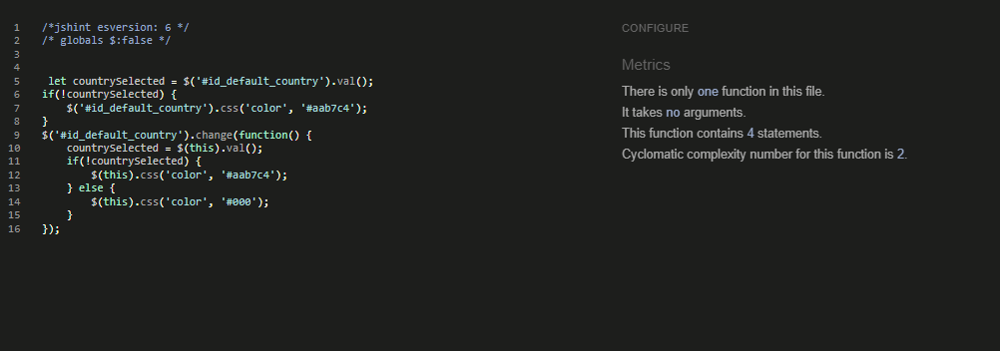
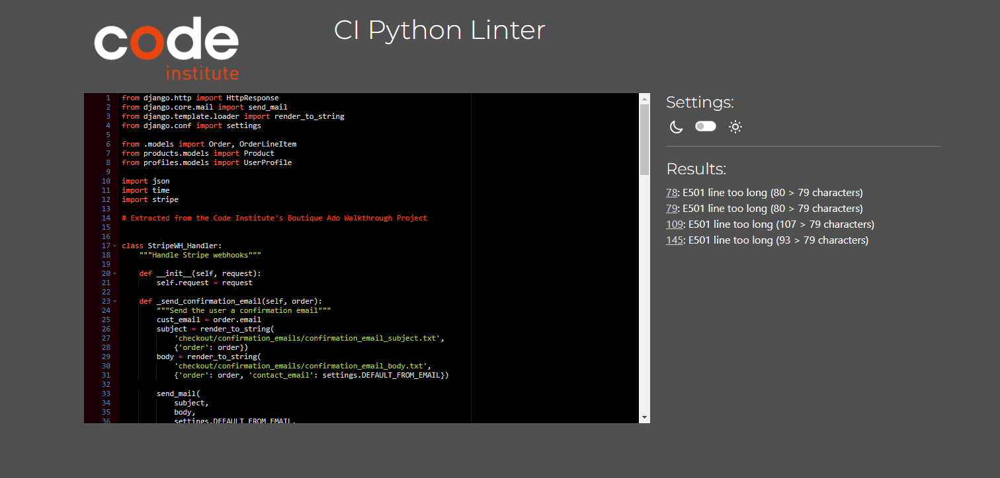
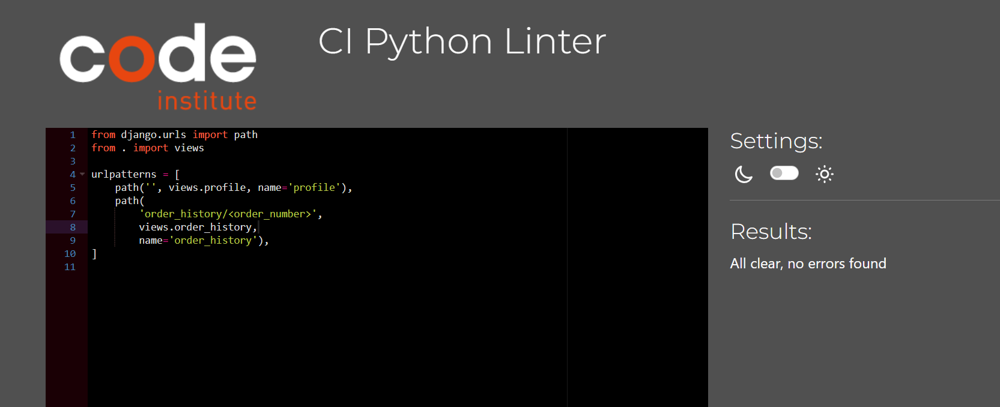
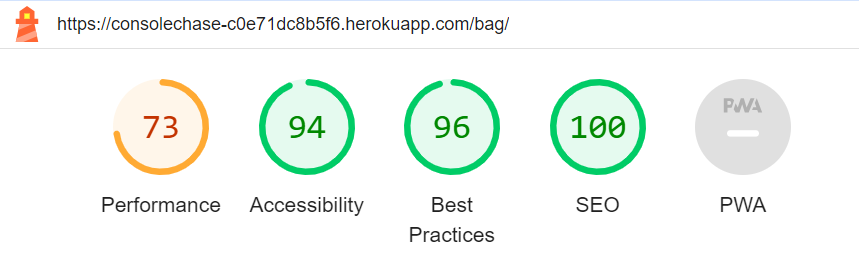
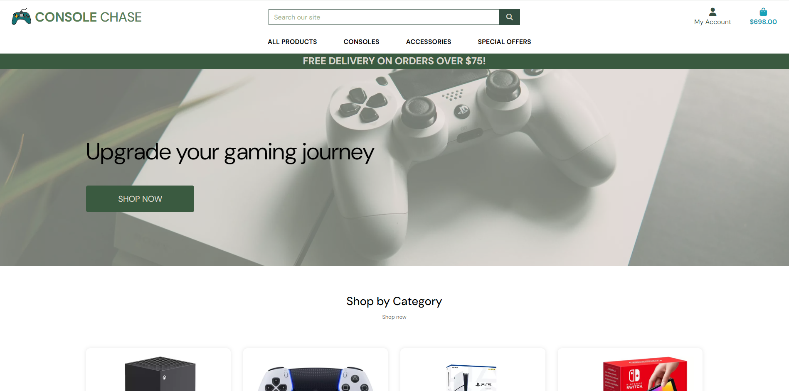

# Testing

This is the TESTING file for the [Console Chase]() website.

Return back to the [README.md](README.md) file.

## Testing Contents  
  
- [Testing](#testing)
  - [Testing Contents](#testing-contents)
  - [Validation](#validation)
    - [HTML Validation](#html-validation)
    - [JavaScript Validation](#javascript-validation)
    - [Python Validation](#python-validation)
    - [CSS Validation](#css-validation)
    - [Lighthouse Scores](#lighthouse-scores)
  - [Manual Testing](#manual-testing)
    - [User Input/Form Validation](#user-inputform-validation)
    - [Browser Compatibility](#browser-compatibility)
    - [Responsiveness](#responsiveness)
    - [Testing User Stories](#testing-user-stories)
  - [Bugs](#bugs)
    - [Unresolved/Known Bugs](#unresolvedknown-bugs)

## Validation

### HTML Validation

For my HTML files I have used [HTML W3C Validator](https://validator.w3.org) to validate all of my HTML files.

  

All HTML pages were validated and received a 'No errors or warning to show' for code that I had written, result as shown above.

| HTML Source Code/Page | Errors | Warnings |
| ---- | ------ | -------- |
| Home | 0 | 0 |
| Wishlist | 0 | 0 |
| Product Detail | 0 | 0 |
| Admin Add Product | ID error -> To tackle the issue stemming from Bootstrap's form elements, unrelated to my code, the clash between the contact form's and the add product form's ID elements in the base.html file needs attention. Regrettably, these embedded ID elements remain out of reach for adjustments without significant modifications and restructuring of my code.   | |
| Admin Edit Product | ID error -> To tackle the issue stemming from Bootstrap's form elements, unrelated to my code, the clash between the contact form's and the add product form's ID elements in the base.html file needs attention. Regrettably, these embedded ID elements remain out of reach for adjustments without significant modifications and restructuring of my code.   | | | 0 |
| Products | 0 | 0 |
| Bag  | 0 | 0 |
| Edit Review  | 0 | 0 |
| Checkout | 0 | 0 |
| Checkout Success | 0 | 0 |
| Profile | 0 | 0 |
| Error 404 | 0 | 0 |

### JavaScript Validation

[JSHint](https://jshint.com/) was used to validate the JavaScript code added to the project. 

| Page | Screenshot | Errors | Warnings |
| ---- | ---------- | ------ | -------- |
| Bag |  | none | none |
| Country Field |  | none | none |
| Increment Quantity |  | none | none |
| Stripe JS |  | none | none |
| Sort |  | none | none |

### Python Validation

[CI Python Linter](https://pep8ci.herokuapp.com/#) was used to validate the Python files that were created or edited by myself. 

| Feature | admin | forms | models | urls | views | extra |
|---------|----------|----------|-----------|---------|----------|-------|
| Bag  | n/a | n/a | n/a |  |  1 warning: line too long. I'm aware of this warning, however, it applies to the time when monitors were limited to 80 characters which is no longer the case and I have no issues with your lines being longer as it makes the code more readable. | | |
| Checkout |  |  |  |  |  4 warnings: line too long. I'm aware of this warning, however, it applies to the time when monitors were limited to 80 characters which is no longer the case and I have no issues with your lines being longer as it makes the code more readable.|4 warning: line too long. I'm aware of this warning, however, it applies to the time when monitors were limited to 80 characters which is no longer the case and I have no issues with your lines being longer as it makes the code more readable.| n/a |
| Home |  | none |  |  |  | n/a |
| Products |  |  |  |  | 1 warning "block comment should start with #(block comment is starting with #) 3 warnings: line too long. I'm aware of this warning, however, it applies to the time when monitors were limited to 80 characters which is no longer the case and I have no issues with your lines being longer as it makes the code more readable. | n/a |
| Profiles |  |  |  |  |  | n/a |
| Wishlist |  | none |  |  |  | n/a |

### CSS Validation

[W3C CSS Validator](https://jigsaw.w3.org/css-validator/) was used to validate my CSS files. 

| CSS File | Errors | Warnings |
| ---- | ------ | -------- |
| Profiles | 0 | 0 |
| Base CSS | 0 | 0 |

### Lighthouse Scores

Lighthouse testing was carried out in Incognito mode to achieve the best result. 

| Page | Lighthouse Scores  |
| ---- | ----------------- |
| Home |      |  
| Add Product  |    | 
| Bag  |    |   
| Checkout |                |   
| Checkout Success |     |    
| Edit Product |     |    
| Error 404 Page |     |    
| Product Detail |     |  
| Products |     |  
| Profile |     |  
| Review Edit |     |  
| Wishlist |     |  

**Overall Lighthouse notes: A few pages with low performance impacted by Stripe Cookies.**

## Manual Testing

### User Input/Form Validation

Testing was carried out on desktop using a Chrome browser to ensure all forms take the intended input and process the input appropriately.

| Feature                    | Tested  | User Input Required  | Pass/Fail |
|----------------------------|----------|---------------------|------------------|
| Navbar Logo and Icons      | Yes     | Clicking on links ensures users are directed to the appropriate pages.    |  Pass |
| Home Page                  | Yes      | Interactive features respond to both hovering and clicking actions.  | Pass | N/A |
| Register Page              | Yes      | Users can either input text or click on links for navigation purposes.  | Pass | 
| Email Validate             | Yes      | Links facilitate seamless navigation throughout the website. | Pass | 
| Forgot Password             | Yes     | Users have the option to input text or utilize links for various actions.  | Pass | 
| Log In Page                | Yes      | Text input and link clicking serve as primary methods of interaction.  | Pass | 
| Log Out Page               | Yes      | Clicking on links guarantees users are taken to the intended destinations. | Pass | 
| Account - Edit Address     | Yes      |Users can choose to either input text or click to save their changes. | Pass | 
| Search                     | Yes      | Text input or clicking facilitates the search functionality within the platform.| Pass |
| Contact Us Form            | Yes      | Inputting text or clicking allows users to save their preferences.  | Pass | 
| Newsletter Sign Up         | Yes      | Text inputting or clicking enables users to subscribe to desired content.  | Pass | 
| Admin Dashboard            | Yes      | Links ensure users are directed to the correct web addresses.  | Pass | 
| Products                   | Yes      | Clicking on a product triggers redirection to its detailed description. | Pass | 
| Add Product                | Yes      | Navigated to Admin Dashboard, clicked 'Add Product', Completed form, Form submits correctly to display the product.  | Pass |  
| Edit Product               | Yes      | Navigating to the Admin Dashboard, selecting 'Edit Product,' completing the form, and successfully submitting it showcases the updated product.  | Pass | 
| Product Quantity           | Yes      | Incrementing or decrementing actions can be executed with a simple click. | Pass | 
| Checkout                   | Yes      | Clicking 'Secure Checkout' after verifying the contents of the shopping bag, entering delivery and payment details, and submitting the form ensures a seamless payment process. | Pass | N/A |
| Footer                     | Yes      | Clicking on a specific link directs users to a collection of useful resources. | Pass |

### Browser Compatibility

Console Chase was tested on the following browsers.

- Chrome v117.0.5938.92
- Firefox v114.0.2
- Edge v114.0.1823.79
- Safari v16.5.1

| Browser | Issue | Functionality |
|---------|-------|---------------|
| Firefox | None  | All Intact    |
| Edge    | None  | All Intact    |
| Safari  | None | All Intact  |
| Chrome (Main browser used in development) | None | All Intact |

### Responsiveness

Console Chase is designed to be responsive across all screen sizes, ensuring a seamless browsing experience whether you're accessing it from a desktop computer, laptop, tablet, or smartphone. With responsive design, our site dynamically adjusts its layout and content to fit the screen dimensions of any device, providing optimal viewing and interaction for all users. Whether you're at home, on the go, or switching between devices, you can enjoy consistent functionality and aesthetics across the board.

* Phone

  

* Tablet

  

* Laptop

  

* Larger Screens

  

### Testing User Stories

User Stories are documented in the Console Chase [GitHub Projects Board](https://github.com/users/ruimarnjr/projects/6/views/1). User Stories are completed, with Acceptance Criteria and Tasks detailed within. Testing was carried out on Dev Tools for desktop/tablet/mobile, by creating multiple accounts for test users: Test01, Test02, Test03 etc and following through by ensuring that the Acceptance Criteria were met. All features were tested to ensure that they provided the user with the expected output and action.

| User Story                 | Implemented? | Tested | Response     | Pass/Fail | Fix     |
|----------------------------|---------------------------|--------|--------------|-----------|---------|
| **As a shopper**, I can **view the site's home page** to **understand its intentions and purpose**. | Yes | Yes | Homepage functionality verified | Pass | n/a |
| **As a shopper**, I can **utilize the navigation bar** to **seamlessly explore and navigate the site**. | Yes | Yes | The navigation bar allows seamless site exploration | Pass | n/a |
| **As a shopper**, I can **enter search queries into the search bar** to **locate specific items efficiently**.. | Yes | Yes | The search bar facilitates efficient item location through search queries | Pass | n/a |
| **As a shopper**, I can **navigate to the 'All Products' view** to **explore the complete product catalog**. | Yes | Yes | Accessing the 'All Products' view allows exploration of the complete product catalog | Pass | n/a |
| **As a shopper**, I can **create and manage** an account for storing personal details, order history, and expediting the checkout process. | Yes | Yes | Managing an account enables the storage of personal details, order history, and streamlines the checkout process | Pass | n/a |
| **As a shopper**, I can **edit personal details on the account** to **ensure they remain current and accurate**. | Yes | Yes | Editing personal details in the account ensures they stay current and accurate | Pass | n/a |
| **As a shopper**, I can select an individual product to access detailed information such as description, price. | Yes | Yes | Selecting an individual product provides access to detailed information including description, price. | Pass | n/a |
| **As a shopper**, I can **click on 'Add to Bag' in the product view** to **include the chosen item in the shopping bag**. | Yes | Yes | Clicking on 'Add to Bag' in the product view adds the chosen item to the shopping bag | Pass | n/a |
| **As a shopper**, I can **adjust quantities or remove products from the shopping bag** for **better control over the purchase**. | Yes | Yes | I can easily adjust quantities or remove products from the shopping bag to have better control over the purchase. | Pass | n/a |
| **As a shopper**, I can **view the shopping bag total from any page** to **monitor potential spending**. | Yes | Yes | I can conveniently view the shopping bag total from any page to keep track of potential spending. | Pass | n/a |
| **As a shopper**, I can **securely complete the checkout process** to **finalize the purchase**. | Yes | Yes | I can securely complete the checkout process to finalize the purchase. | Pass | n/a |
| **As a shopper**, I can **receive a confirmation email post-purchase** to **verify and maintain a record of the order**. | Yes | Yes | I can receive a confirmation email after making a purchase to verify and maintain a record of the order. | Pass | n/a |
| **As site user**, I can **utilize the Contact Us form** to **communicate with the business/site admin**. | Yes | Yes | I can use the Contact Us form to communicate with the business or site administrator. | Pass | n/a |
| **As a shopper**, I can **receive visual feedback during store interactions** to **confirm actions and choices**. | Yes | Yes | I can receive visual feedback during store interactions, which confirms my actions and choices. | Pass | n/a |
| **As a shopper**, I can **participate in reading and writing product reviews** to **make informed purchase decisions and share experiences with other users**. | Yes | Yes | Users can participate in reading and writing product reviews, enabling them to make informed purchase decisions and share experiences with other users | Pass | n/a |
| **As a site user**, I can **provide my information through the newsletter form** to **receive emails regarding products**. | Yes | Yes | Users can provide their information through the newsletter form to receive emails regarding products. | Pass | n/a |
| **As a site admin**, I can **add products to the inventory using a frontend form** to **expand the range/quantity of available products on the site**. | Yes | Yes | Adding products through a frontend form helps broaden the range and quantity of items available on the site's inventory. | Pass | n/a |
| **As a site admin**, I can **edit existing inventory details through a frontend form** to **modify stock quantities, sizes, colors, or product information**. | Yes | Yes | Editing existing inventory details via a frontend form allows for modifications to stock quantities, sizes, colors, or product information. | Pass | n/a |
| **As a site admin**, I can **delete products from the inventory using a frontend form** to **remove them from sale**. | Yes | Yes | Deleting products from the inventory via a frontend form allows for their removal from sale | Pass | n/a |
| **As a public user**, I can **enter login details** to **access the user account securely**. | Yes | Yes | Entering login details enables secure access to the user account. | Pass | n/a |
| **As a public user**, I can **click on visible links in the footer** to **access relevant information and destinations**. | Yes | Yes | Clicking on visible links in the footer grants access to relevant information and destinations. | Pass | n/a |
| **As a public user**, I can **select a navbar item for a specific category** to **narrow down the display of related products**. | Yes | Yes | Selecting a navbar item for a specific category filters the display to show related products. |Pass | n/a |
| **As a public user**, I can **interact with sorting and view features on the 'All Products' page** to **enhance the shopping experience**. | Yes | Yes | Interacting with sorting and view features on the 'All Products' page enhances the shopping experience. | Pass | n/a |
|  **As a public user**, I can view error pages with 'Home' links for seamless navigation back to the main page in case of missing or forbidden pages. | Yes | Yes | Error pages include 'Home' links for seamless navigation back to the main page in case of missing or forbidden pages. | Pass | n/a |
|  **As a public user**, I can **register an email and receive a validation link via email to create an account** for **tracking spending and purchases**. | Yes | Yes | Users can register their email and receive a validation link via email to create an account, facilitating the tracking of spending and purchases | Pass | n/a |
| **As a signed-in user**, I can **click the 'Add to Wishlist' button** to **bookmark favorite items**. | Yes | Yes | Users can click the 'Add to Wishlist' button to bookmark favorite items. | Pass | n/a |
**As a signed-in user**, I can **click the 'Remove' icon beside Wishlist items** to **eliminate products from the Wishlist**. | Yes | Yes | Users can click the 'Remove' icon beside Wishlist items to eliminate products from the Wishlist. | Pass | n/a |

## Bugs

| Bug | Solved | Fix | 
| ---------------- | ---- | ------------- | 
  | Account email verification getting back with error 500 in the deployed site| Yes | add runtime.txt file | 
  | Error 401 in stripe | Yes | Changed the workspace public so stripe could get the port 8000 and import stripe in the webhooks.py | 76e8ef8 |
  | Unable to migrate | Yes | Reset database
  

### Unresolved/Known Bugs

There are no known bugs in Console Chase.